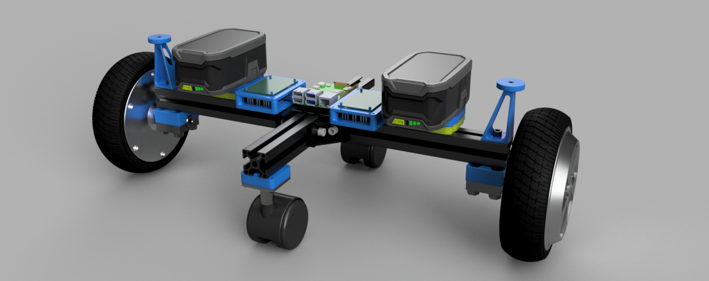
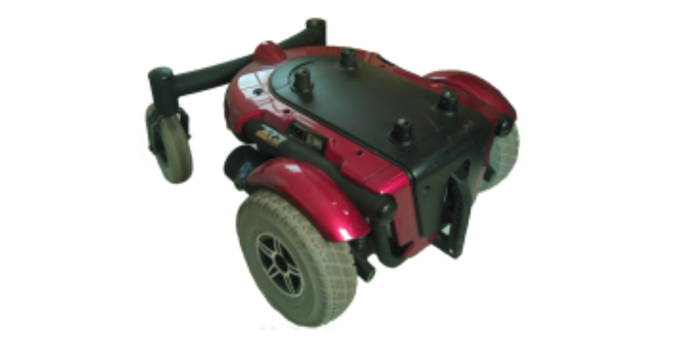
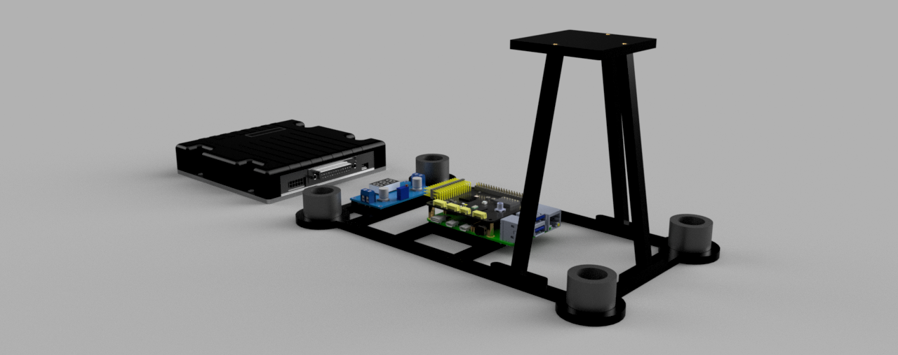

# UV Roberta
UV Roberta is an R/C controlled wheeled robot running on a Raspberry Pi.

## Links
|Item|Link|
|---|---|
|BOM|[bom/roberta-bom.md](bom/roberta-bom.md)|
|Fusion 360 Design|[cad/roberta.f3z](cad/roberta.f3z)|
|Roboteq Contoller|[https://www.roboteq.com/products/products-brushed-dc-motor-controllers/mdc2460-274-detail](https://www.roboteq.com/products/products-brushed-dc-motor-controllers/mdc2460-274-detail)|

## Pevious Version
v1 was a powered wheelchair base.
While it ran great, it was difficult to move from inside to outside or navigate indoors.
So, the current version (above) was started.

