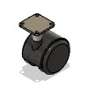
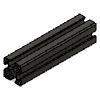
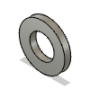

# Roberta BOM

|Image|Name|Number|Description|Quantity|
|-|-|-|-|-|
||3030 Mount:1|3030 Mount||2|
||Battery Terminal Clip v2:1|Battery Terminal Clip||4|
||Cast 90 Degree Corner Bracket for 3030 - 6 Slot - Black v1:1|HW1916BC||4|
||Castor Mount v4:1|Castor Mount||2|
||Castor v3:1|Castor||2|
||Half In Nut v2:1|Half In Nut||8|
||Half In x 1 In Hex Bolt v2:1|Half In x 1 In Hex Bolt||8|
||HFSB6-3030-130 v1:1|HFSB6-3030-130|https://us.misumi-ec.com/vona2/detail/110302686450/?ProductCode=HFSB6-3030-480|2|
||HFSB6-3030-480 v2:1|HFSB6-3030-480|https://us.misumi-ec.com/vona2/detail/110302686450/?ProductCode=HFSB6-3030-480|1|
||M2x10 BHCS Self Tapping v2:1|M2x10 Self-tapping Screw||6|
||M3 T-Nut 3030 v2:1|M3 T-Nut 3030||4|
||M3x12 SHCS v3:1|M3x12 SHCS|Affiliate Link: https://amzn.to/3RQOZCR|8|
||M3x5x4 Threaded Insert v3:1|M3x5x4 Threaded Insert|Affiliate Link: https://amzn.to/48DnORF|10|
||M3x8 SHCS v3:1|M3x8 SHCS|Affiliate Link: https://amzn.to/3thA1vh|6|
||M6 T-Nut 3030 v3:1|M6 T-Nut 3030||10|
||M6x10 SHCS v1:1|HW1836SC||18|
||Mast:1|Mast||2|
||Mount:1|Mount||2|
||PCB DIN Clip v3:1|PCB DIN Clip||1|
||Raspberry Pi 4 Model B v2:1|Raspberry Pi 4 Model B||1|
||Raspberry Pi Bracket v1:1|Raspberry Pi Bracket||1|
||Rim v1:1|Rim||2|
||Ryobi 4Ah Battery v2:1|Ryobi 4Ah Battery||2|
||T-Nut - Drop In for 3030 - M6 v1:1|HW1361NC||8|
||Washer Simple M6 v2:1|HW1314NC|Black ones: https://amzn.to/3ood0o1|8|
||Wheel Mount Top v7:1|Wheel Mount Top||2|
||Wheel Mount v1:1|Wheel Mount||2|
||Wheeled Motor Assembly v5:1|Wheeled Motor Assembly||2|
||ZS-X11H Assembly v4:1|ZS-X11H Assembly||2|
||ZS-X11H Mount v13:1|ZS-X11H Mount||2|
||ZS-X11H Spacer v11:1|ZS-X11H Spacer||2|