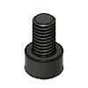

# Wheel Mount Assembly BOM

|Image|Name|Number|Description|Quantity|
|-|-|-|-|-|
||Half In Nut v2:1|Half In Nut||4|
||Half In x 1 In Hex Bolt v2:1|Half In x 1 In Hex Bolt||4|
||M6 T-Nut 3030 v3:1|M6 T-Nut 3030||2|
||M6x10 SHCS v1:1|HW1836SC||2|
||Wheel Mount Top v7:1|Wheel Mount Top||1|
||Wheel Mount v1:1|Wheel Mount||1|
||Wheeled Motor Assembly v5:1|Wheeled Motor Assembly||1|