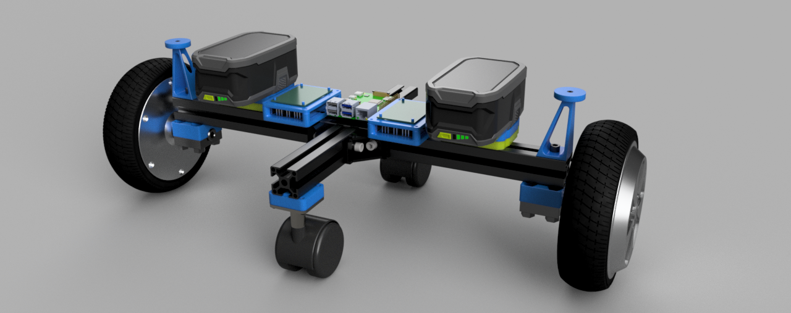
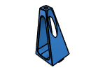
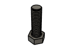

# Roberta BOM

|Image|Name|Number|Description|Quantity|
|-|-|-|-|-|
||Battery Terminal Clip v3:1|Battery Terminal Clip|Affiliate Link: https://amzn.to/4hlRYw2|4|
||Cast 90 Degree Corner Bracket for 3030 - 6 Slot - Black v2:1|HW1916BC|Affiliate Link: https://amzn.to/4hflnYI|4|
||Castor Mount v4:1|Castor Mount||2|
||Castor v3:1|Castor||2|
||GPS Mast:1|GPS Mast||2|
||GPS Mount:1|GPS Mount||2|
||Half In Nut v2:1|Half In Nut||8|
||Half In x 1 In Hex Bolt v2:1|Half In x 1 In Hex Bolt||8|
||HFSB6-3030-130 v1:1|HFSB6-3030-130|https://us.misumi-ec.com/vona2/detail/110302686450/?ProductCode=HFSB6-3030-480|2|
||HFSB6-3030-480 v2:1|HFSB6-3030-480|https://us.misumi-ec.com/vona2/detail/110302686450/?ProductCode=HFSB6-3030-480|1|
||M2x10 BHCS Self Tapping v3:1|M2x10 Self-tapping Screw|Affiliate Link: https://amzn.to/3FmX3H0|6|
||M3 T-Nut 3030 v3:1|M3 T-Nut 3030|Affiliate Link: https://amzn.to/3DANnrU|4|
||M3x12 SHCS v3:1|M3x12 SHCS|Affiliate Link: https://amzn.to/3RQOZCR|8|
||M3x5x4 Threaded Insert v3:1|M3x5x4 Threaded Insert|Affiliate Link: https://amzn.to/48DnORF|10|
||M3x8 SHCS v3:1|M3x8 SHCS|Affiliate Link: https://amzn.to/3thA1vh|6|
||M6 T-Nut 3030 v4:1|M6 T-Nut 3030|Affiliate Link: https://amzn.to/3Dp0qg3|18|
||M6 Washer v2:1|HW1314NC|Affiliate Link: https://amzn.to/4bB8iHS|8|
||M6x10 SHCS v2:1|HW1836SC|Affiliate Link: https://amzn.to/4bBjXXd|18|
||PCB DIN Clip v3:1|PCB DIN Clip||1|
||Raspberry Pi 4 Model B v3:1|Raspberry Pi 4 Model B|Affiliate Link: https://amzn.to/4i9CtZf|1|
||Raspberry Pi Bracket v1:1|Raspberry Pi Bracket||1|
||Ryobi 4Ah Battery v3:1|Ryobi 4Ah Battery|Affiliate Link: https://amzn.to/3Fe0b8j|2|
||Ryobi Batt 3030 Mount:1|Ryobi Batt 3030 Mount||2|
||Ryobi Batt Mount Rim v3:1|Ryobi Batt Mount Rim||2|
||Wheel Mount Top v7:1|Wheel Mount Top||2|
||Wheel Mount v1:1|Wheel Mount||2|
||Wheeled Motor Assembly v5:1|Wheeled Motor Assembly||2|
||ZS-X11H Assembly v5:1|ZS-X11H Assembly|Affiliate Link: https://amzn.to/4i9CJaF|2|
||ZS-X11H Mount v13:1|ZS-X11H Mount||2|
||ZS-X11H Spacer v11:1|ZS-X11H Spacer||2|